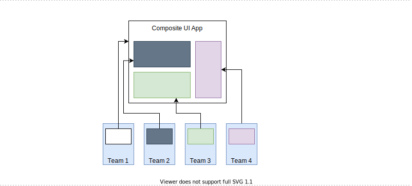
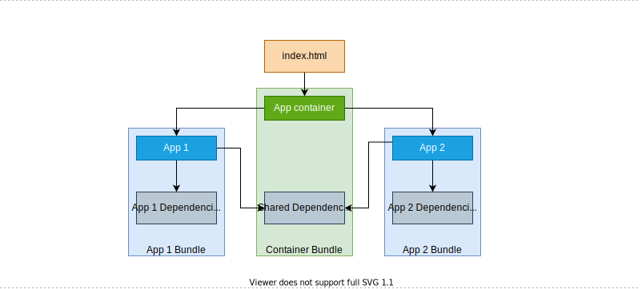
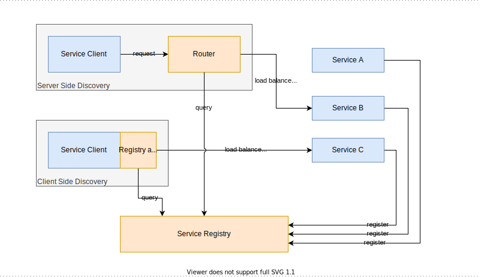
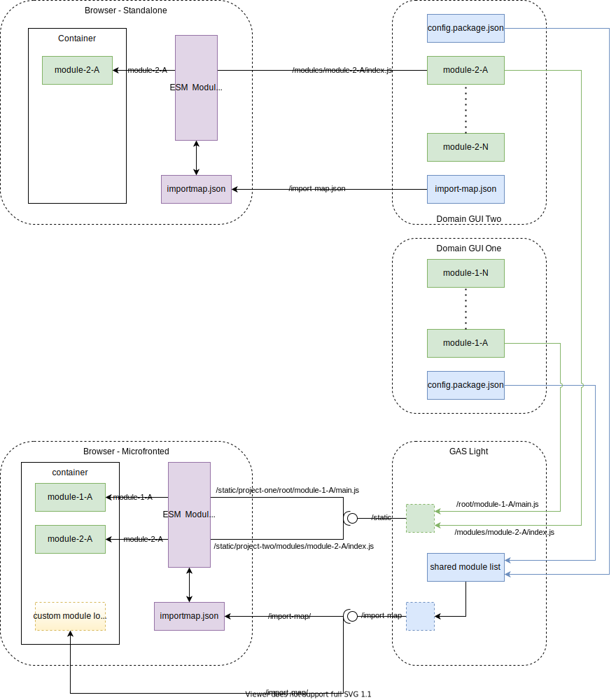

# Micro-Frontend Concept

[TOC]

## Overview

This document provides an overview about the Micro-frontend concept supported by GUI Aggregator
Lightweight (GAS Light).

## Patterns

**Micro-frontend** is a User Interface (UI) layer architecture style introduced by
[Thoughtworks](https://www.thoughtworks.com/radar/techniques/micro-frontends) that describes a
pattern of composing a UI layer from a set of UI contributions implemented by different microservice
teams in a microservice architecture. As such, it is a suitable pattern to address the architectural
goal of implementing a unified, common UI workspace based on UI contributions from multiple
microservices.

### Micro-frontend Pattern

Generally, in the Kubernetes® container orchestration engine and the Application Development
Platform (ADP) the microservice architecture pattern is followed (see
[Pattern: Microservice Architecture](https://microservices.io/patterns/microservices.html) for more
information), where an application is split into several loosely-coupled microservices.
Each microservice is characterized by the following:

- Highly maintainable and testable, which enables rapid and frequent development and deployment
- Loosely coupled with other services, which enables a team to work independently most of the time
  on their microservice(s) without being impacted by changes to other services and without affecting
  other services
- Independently deployable, which enables a team to deploy their microservice without having to
  coordinate with other teams
- Capable of being developed by a small team, which is essential for high productivity by avoiding
  the high communication overhead of large teams

The **micro-frontend** pattern is used to adapt the microservice architecture pattern to UI
Applications.

Micro-frontend is a UI-layer architecture pattern of composing a UI layer from a set of
UI contributions implemented by different microservice teams in a microservice architecture.
When splitting a frontend monolith into micro-frontends, the overall UI must be recombined before
rendering it to the end user, for example, in the Web Browser using some form of UI composition.

### UI Composition Strategies

The following different strategies can be applied for UI composition:

- Build-time integration, for example, to integrate npm® packages together
- Server or Edge-side composition, which means that an HTML page is assembled at server side, where
  parts of the page are generated by different microservices
- Client-side composition, which means that UI parts are loaded and assembled in the browser using
  JavaScript

The client-side composition architecture pattern is employed to achieve UI composition in the
micro-frontend architecture. This pattern composes UIs from their component module contributions
from different microservices on the client device, typically using JavaScript in the case of web
applications.

The following figure shows the client-side UI composition architecture pattern.



For more information, see
[Client-side UI composition](https://microservices.io/patterns/ui/client-side-ui-composition.html).

### Application Shell Pattern

The application shell pattern is used to manage navigation and transition between UI applications
(full-screen contributions from microservices). This pattern promotes the delivery of a
common container HTML page that is used across many views as a way of managing UI content in a
multi-view single-page application architecture. The application shell delivers content that is
common across all applications so that it does not have to be downloaded and processed individually,
thereby offering performance benefits to the end user.

The Ericsson User Interface Software Development Kit (EUISDK) Application Container is an
implementation of the application shell pattern.

The following figure shows the application shell pattern.



### Service Discovery Patterns

In a modern microservice-based application, the number of microservices and their locations change
dynamically. To correctly assemble the UI at the client side, it is necessary to find the backend
services which host the various UI fragments.
A **Service Registry** is used for storing the location of all service instances.
The following service discovery patterns are available for finding the backend services:

- [Server-side service discovery](https://microservices.io/patterns/server-side-discovery.html),
  where there is a Router component that communicates with the Service Registry, and routes incoming
  requests from the client to a service.
- [Client-side service discovery](https://microservices.io/patterns/client-side-discovery.html),
  where the client communicates with the Service Registry and directly queries the location
  information.

In the micro-frontend architecture, both service discovery patterns are used for a degree.
GAS Light is an implementation of the server-side service discovery pattern. It is responsible
for routing traffic to the services, and it maintains the Service Registry.
However, the import map-based ECMAScript module loading in the browser uses client-side service
discovery, where the generated import map is a snapshot of the Service Registry containing all the
necessary information to make successful requests to services.

The following figure shows the available service discovery patterns.



## Technology Overview

### ECMAScript Modules (ESM)

ECMAScript Modules (ESM) are the standard module format to define JavaScript modules in the browser.
This is supported by evergreen browsers (that is, browsers that are upgraded automatically). ESM
provides a language syntax to define dependencies by import statements. Public module content can be
defined by export statements, which then can be imported by other modules.

The import syntax requires an URL that defines where the module can be found.
The URL can be relative or absolute, and must also contain the extension. With the import map, the
module names can be bare identifiers, and the exact identifier-URL mapping is defined in a
configuration map.

For more information about JavaScript modules, see
[JavaScript modules](https://developer.mozilla.org/en-US/docs/Web/JavaScript/Guide/Modules).

The following example shows the different URL types in the import syntax.

```javascript
// absolute URL
import moment from 'https://cdn.jsdelivr.net/npm/moment@2.29.1/moment.js';
// relative URL
import '../chart-donut.js';
// host-relative URL
import '/3pp/moment.js';
// bare-identifier, works only with import-map
import { LitComponent, html, definition } from '@eui/lit-component';

class CompC extends LitComponent {}
definition('comp-c', {})(CompC);
export { CompC };
```

### Import Map

The import map is a standard proposal to support the use of bare identifiers on the web.
It is partially supported by the Google Chrome™ browser (import maps can be defined in HTML,
but cannot be fetched from a remote location).

For more information about import maps, see the [Import Maps](https://wicg.github.io/)
documentation, and [Import maps on GitHub](https://github.com/WICG/import-maps).

The following tools are available for using import maps:

- [es-module-shims](https://github.com/guybedford/es-module-shims):
  the module and `import-map` tags are transcompiled in a WebAssembly (Wasm) module at runtime.
- [SystemJS](https://github.com/systemjs/systemjs/blob/master/docs/import-maps.md):
  SystemJS implements `systemjs-importmap` according to the specifications.

The import map can be defined in HTML with the `<script type="importmap">` tag. The content can
be added inline, or by defining a `src` attribute.

The following example shows an import map definition in HTML:

```javascript
<!doctype html>
<html>
<head>
  <script type="importmap">
  {
    "imports":
      {
        "@eui/components": "./libs/eui/1.0.0/components/main.js"
      }
  }
  </script>
  <script type="module">
    import { CompC } from '@eui/components';
    CompC.register();
  </script>
</head>
<body>
  <comp-c></comp-c>
</body>
</html>
```

The import map contains a **string-to-URL** mapping, which can be used to map or remap specifiers.
A special case is when the specifier has a trailing slash, which results in the specifier being
treated as a prefix. The following are example use cases:

- Bare specifiers for JavaScript modules
- "Packages" through trailing slashes
- Extensionless imports
- General URL-like specifier remapping
- Mapping away hashes in script filenames

Import Maps support the concept of scopes, where in different contexts the bare-identifier mappings
can be changed. With scopes, it is possible to use the same identifier in different modules and load
different versions of that identifier. For more details, check the [Import Maps documentation](https://wicg.github.io/import-maps/).

**Note:** Scopes are defined as URL prefixes and not as exact modules.

The following example shows a scope definition and also how scope inheritance works:

```javascript
// Multiple versions of the same module
{
  "imports": {
    "querystringify": "/node_modules/querystringify/index.js"
  },
  "scopes": {
    "/node_modules/socksjs-client/": {
      "querystringify": "/node_modules/socksjs-client/querystringify/index.js"
    }
  }
}

// Scope inheritance
{
  "imports": {
    "a": "/a-1.mjs",
    "b": "/b-1.mjs",
    "c": "/c-1.mjs"
  },
  "scopes": {
    "/scope2/": {
      "a": "/a-2.mjs"
    },
    "/scope2/scope3/": {
      "b": "/b-3.mjs"
    }
  }
}
```

## UI-Serve API

The UI-Serve API is responsible to route client requests to the backend services and to generate
an import map for the client-side module loading.

The following figures shows an example for the role fo the UI-Serve API, with two projects that
serve different UI components and modules.



The UI-Serve implementation can fetch the relevant configurations from Project One and Project Two
to get an overall list of shared modules. Then an import map can be generated from the shared module
list, which then can be used as input for ESM systems or SystemJS-based module loading.

For the API reference, check the [API documentation](https://adp.ericsson.se/marketplace/gui-aggregator-lightweight/documentation/development/dpi/api-documentation)
on the Marketplace or check the OpenApi spec in the [GAS Light repo](https://gerrit-gamma.gic.ericsson.se/plugins/gitiles/EEA/adp-ui-service/+/master/docs/api/ui-serve).

### Domain Service UID

The Static and Import Map endpoints refer to the domain services with a globally unique ID.
The ID is generated from the labels of the discovered service, using the mandatory
`app.kubernetes.io/name` and `app.kubernetes.io/version` labels.

For more information about these labels, check [General Helm Chart Structure](https://eteamspace.internal.ericsson.com/display/AA/General+Helm+Chart+Structure#GeneralHelmChartStructure-DR-D1121-144)
(DR-D1121-144).

### Static Serve Endpoint

The Static endpoint can be accessed at the following URL: `/ui-serve/v1/static/<globalUniqueURI>`.

The static serve endpoint acts as a reverse-proxy and returns a requested static asset
from a domain service identified by `globalUniqueURI`.

This endpoint is used **internally** by the browser when resolving module identifiers to URLs by using
the import map generated by the `/import-map` API.

The Static endpoint is useful to fetch the modules as it retains module context, and **relative**
URLs are not broken. However, **host-relative** URLs are broken as they would send requests to
different URLs while avoiding the Static endpoint.

**Note:** The mapping of static assets to globally unique URLs (`globalUniqueURI`) depends on
the actual implementation, which **MIGHT** change in the future.
This endpoint **MUST NOT** be used directly at the client side because backward compatibility
is not guaranteed in the `globalUniqueURI` resolution logic.

The `globalUniqueURI` contains a unique `serviceId` that identifies a domain service,
and a `filePath` that is the path to the requested file relative to
the root of the web server serving the static asset for the domain service:
`{serviceId}/{filePath}`.

### Import Map Endpoint

The Import Map endpoint can be accessed at the following URL: `/ui-serve/v1/import-map/`. This URL
returns the import map that is generated from the overall package list fetched from domain services.
The import map contains multiple entries for each package, and also defines the scopes based on the
required dependencies.

Each package has the following entries to support different ESM import use cases:

- `packageName` is used for loading the main module.
- `packageName/<asset_name>` is used to enable loading additional assets, for example,
  `packageName/secondModule.js`.
- `packageName@version` is used to load the main module from the specified package version.
- `packageName@version/<version_number>` is used to access the exact package version.

Scopes are defined based on the dependencies list of the package. The exposed URL to the package
folder is used at the scope definitions.

In case of naming conflict, the highest version is used at the top level import map.

### ESM demo

It can be found within the gas demo deployment. It is implemented to show the capabilities of the
import-map and expose API concepts. With the help of the Import Map endpoint it calculates the
import-map from the esm-mock services.

The demo mock consists of three separate services. The esm-container is the main service which
contains the index.html which displays the fetched modules. There are two more services in which
there are the modules to be fetched. (Simple JavaScript files as of now). Both services have a
`package.config.json` file for the calculation.

After this import-map is generated by GAS, the list of esm-modules are displayed in the
`<gas-path>/ui-serve/v1/static/demo-ui-service-esma-esma/index.html` endpoint.

Some possible use cases to demonstrate:

- module loading
- multi version handling of modules
