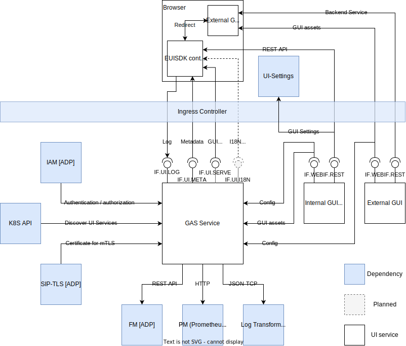
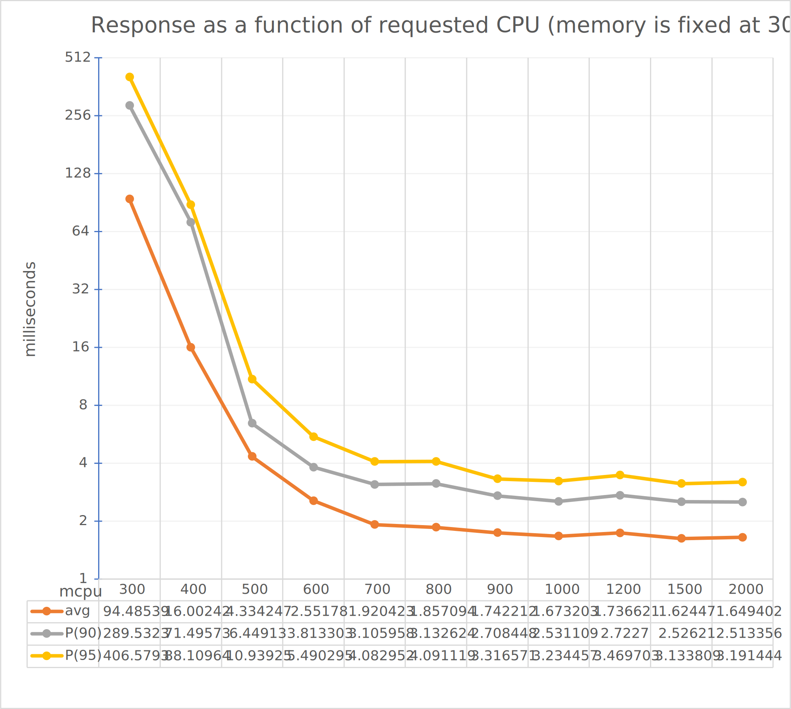
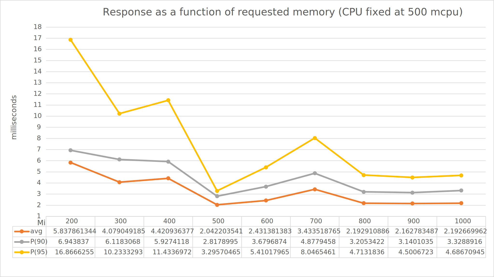
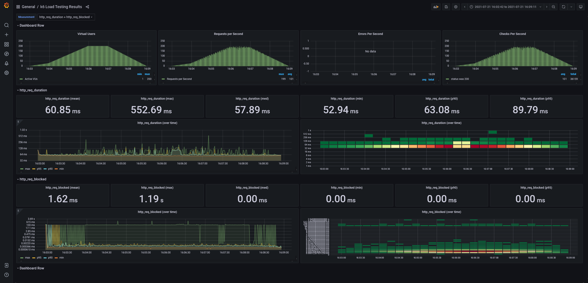

<!-- markdownlint-disable MD024 -->

# GUI Aggregator Lightweight User Guide

[TOC]

## Overview

This document provides an overview of GUI Aggregator Lightweight (GAS Light). It provides a
brief description of its main features and its interfaces.

GAS Light consists of the following components:

- **Portal** (web client): controls the main layout, displays web applications, provides navigation
  among them, and also provides further user functions such as grouping, filtering, searching.
- **Launcher** web application: provides a landing page for the Portal, shows the available applications
  in different groups.
- **GAS Light Backend** (web service): provides autodiscovery of deployed web applications in a
  Kubernetes cluster and fetches metadata as well as static configuration for external applications.
  It also provides a User Interface (UI) for end users, and a RESTful API.

### Micro-Frontend

GAS Light implements and supports the micro-frontend patterns to assemble GUIs runtime from components
delivered by other microservices.

To integrate a UI application into the Portal check the _Application Developers Guide_.

For technology overview, see the [Micro-frontend Concepts](https://adp.ericsson.se/marketplace/gui-aggregator-lightweight/documentation/development/additional-documents/microfronted-concept)
document on the Application Development Platform (ADP) Marketplace page for GUI Aggregator Service.

### Supported Use Cases

The following table lists the supported use cases of GAS Light.

| Use Case ID | Use Case Title                                                                                | Compliance      | Maturity |
| ----------- | --------------------------------------------------------------------------------------------- | --------------- | -------- |
| 1           | Portal: Display (GUI) Apps, Product and Groups                                                | Fully supported | Stable   |
| 2           | Portal: Mark Apps as favorite                                                                 | Fully supported | Stable   |
| 3           | Portal: Display recently used Apps                                                            | Fully supported | Stable   |
| 4           | Backend: Discover Apps deployed in a Kubernetes namespace and load their GUI metadata         | Fully supported | Stable   |
| 5           | Backend: Load Apps (GUI metadata) from manual configuration                                   | Fully supported | Stable   |
| 6           | Backend: Collect client-side log messages                                                     | Fully supported | Stable   |
| 7           | Backend: Proxy static assets                                                                  | Fully supported | Stable   |
| 8           | Backend: Generate import map for ECMAScript Modules                                           | Fully supported | Stable   |
| 9           | Backend: Receive runtime GUI metadata change notification                                     | Fully supported | Stable   |
| 10          | Portal: Authentication & Authorization - Login, logout                                        | Fully supported | Stable   |
| 11          | Portal: Display username, previous login time, link to Edit User Account page                 | Fully supported | Stable   |
| 12          | Micro-Frontend support by "Shared UI Components" - Dynamic Runtime Composition (by #7 and #8) | Fully supported | Stable   |
| 13          | Portal: Load E-UISDK Apps dynamically (as SPA)                                                | Fully supported | Stable   |
| 14          | Portal: Load Web Page (GUI App) in "iframe mode"                                              | Fully supported | Stable   |
| 15          | Portal: Open Web Page (GUI App) in new tab/window                                             | Fully supported | Stable   |
| 15          | Portal: Settings persistence                                                                  | Fully supported | Stable   |

The subsections of this section provide more details about the individual use cases.

For technical details, see the _Application Developers Guide_.

#### Portal UI

GAS Light provides a UI container (Portal) and a Launcher UI Application, implemented in EUISDK,
to show the deployed UI Applications to the end users. The deployed applications are opened in
a new tab and navigate away from the Portal.

**Note:** With the new Micro-frontend solution, compatible UI applications can be opened in the
Portal container.

The Portal is served by GAS Light, and can be accessed through Ingress on the `/ui/` path.
Portal resources are `brotli` compressed for optimal loading performance.

#### Application Discovery

GAS Light can discover services providing UI Applications based on Kubernetes labels and annotations
applied to the `Service` type. Found services will only be listed if they are not headless, meaning
they have at least one active `Endpoint` attached to them.

After discovery, GAS Light checks for changes as well to update or delete already discovered service
configurations.

**Note:** Autodiscovery works only within the same Kubernetes namespace due to security reasons.

#### Manual Service Configuration

Domain services can also be manually defined in Helm values with `manualconfig.service` attribute.

This list of services is merged with those coming from the auto discovery feature. They are
treated exactly the same as if they were autodiscovered from Kubernetes.

#### Aggregate UI Metadata

Each discovered UI Service must provide a configuration descriptor (`config.json`) about all the
provided UI Applications. These Applications are then displayed on the Launcher
with the defined Product and Domain groupings.

The aggregated metadata can be read from the UI-Meta API.

#### Serving Static Content

To enable the Micro-frontend solution, GAS Light can also serve static contents from the discovered
services.
For serving static contents, a dynamic proxy endpoint is implemented in the UI-Serve API.

#### Import Map Generation

The Micro-fronted concept is built on ECMAScript modules, and to use them in the browser, a
dynamically aggregated configuration is generated. For this feature, UI Applications must provide a
configuration descriptor (`config.package.json`) about the provided ECMAScript modules and packages.

The generated import map can be read from the UI-Serve API.

#### Collection of Client-Side Logs

GAS Light provides a REST API to collect log messages from client-side applications. Logs sent to
this REST API are processed and sent to the configured log system.

The logs are collected on the UI-Logging API.

#### Runtime change notification

GAS is stateless, but runs in a multi-pod replica-set. Each pod in the replica-set discovers
the Services and fetches the configs individually based on K8s resources and manual static values
from Helm.

There is no runtime data synchronization between the pods, they are completely independent.

Solution is a POST REST endpoint with the required service name attached, which tells the UICollection
to update the configs for that particular service. The name property is the internal name of the service.

#### Distributed System Tracing (DST)

Distributed Systems Tracing is used to trace communication between microservices. A trace contains
information about the communication path between the components, which components are involved and
how much time a component used to do its work.

The traces are collected and processed by the DST Collector Service, which will send them to a
remote database. The DST Query Service will fetch those traces from the database and it will
visualize it on the Jaeger UI. The frequency of traces is controlled by the sampling rate property.

If distributed tracing is enabled, the DST component of GAS Light is deployed with
the default sampling rate defined by `dst.sampler.samplingRate` property of GAS Light `values.yaml`.
However, DST Collector is providing a remote sampling rate configuration, which can override
the default GAS Light sampling rate. See details in the next chapter.

Please note that enabling DST services with trace collecting of all requests will
lead to negligible changes in performance.

##### Runtime configuration

To set the log level dynamically at runtime, please modify the `eric-dst-collector-remote-sampling`
Kubernetes ConfigMap configuration file of the DST Collector Service. This configuration
is deployed automatically in the same namespace as GAS Light, and besides providing a default
sampling strategy, it can optionally define service based strategies as well.

Every strategy must declare a strategy type. GAS Light only supports the default type, which is `probabilistic`.
This sampler makes a random sampling decision with the probability of sampling equal to the value of
the sampling rate property.

To modify GAS Light sampling rate, edit the above configmap and either create a service
level strategy for GAS Light with a custom `param` value (or update that if already exists),
or edit the `param` attribute of the default strategy. Please consider that changing the default
strategy can impact every service in the namespace, which is providing traces.

```bash
kubectl edit configmap eric-dst-collector-remote-sampling -n <namespace> -o yaml
```

For complete tracing set sampling rate to 1, while to turn off tracing, set 0.
Any other value between 0 and 1 also enables trace collection, but is not practical for debugging,
because it introduces randomness.

Please note that if above configmap is available, but does not contain any valid service or
default strategy (for example the type is not supported or the rate value is missing or corrupt),
then the sampling rate will be reset to 0.

See the following example for a valid `eric-dst-collector-remote-sampling` configmap that turns on
a complete trace by defining a service level strategy based on the Kubernetes service name of GAS Light:

```yaml
apiVersion: v1
data:
  samplingstrategies.json: |-
    {
      "service_strategies": [
         {
          "service": "eric-adp-gui-aggregator-service",
          "type": "probabilistic",
          "param": 1.0
        }
      ],
      "default_strategy": {
        "type": "probabilistic",
        "param": 0.0
      }
    }
```

If there are no service strategies, the rate can be set to 1 with the following command as well:

```bash
kubectl get configmaps eric-dst-collector-remote-sampling -n <namespace> -o yaml | sed -E \
's/param": .*/param": 1.0/' | kubectl replace -f -
```

Nevertheless, tracing shall be turned off (with sampling rate 0) after the debugging is finished.

#### Settings persistence

The GUI settings can be stored into the browser's LocalStorage or into a DB managed by the
[UI-Settings Service](https://adp.ericsson.se/marketplace/ui-settings).
See detailed description in _Application Developers Guide_.

For LocalStorage mode set the `uiconfig.uiSettings.storageMode` parameter to `localStorage`.

For DB mode set the `uiconfig.uiSettings.storageMode` parameter to `uiSettingsService`, and set the
`uiconfig.uiSettings.storageMode` parameter to the deployed UI-Settings Service base URL.

**Note: For DB mode the UI-Settings Service must be deployed.**

### Architecture View

The following figure shows the architecture view of GAS Light.


_Figure 1 Architecture View of GAS Light_

### Interfaces and Connections

#### Provided Interfaces

GAS Light provides a UI for end users: the Launcher application (web client),
which complies with Ericsson Design System (EDS) requirements.

The following table contains details about the APIs provided by GAS Light (backend).

| Interface Logical Name | Interface Realization                    | Description                                                                                          | Release Phase |
| ---------------------- | ---------------------------------------- | ---------------------------------------------------------------------------------------------------- | ------------- |
| Meta API               | [Specification][ui-meta-api]             | This interface provides access to metadata of applications contributed by microservices.             | Stable        |
| Logging API            | [Specification][ui-logging-api]          | This interface enables UI applications and containers to post logs generated on the client side.     | Stable        |
| Serve API              | [Specification][ui-serve-api]            | This interface provides access to static assets and ECMAScript modules contributed by microservices. | Stable        |
| PM Server              | [PM Server specification][pm-server-sug] | Used for exposing Performance Metrics                                                                | Stable        |
| UI API                 | [Specification][ui-interface]            | This interface serves static assets                                                                  | Stable        |
| User permission API    | [Specification][userpermission]          | This interface provides access to the IAM user data.                                                 | Stable        |

#### Consumed Interfaces

| Interface                  | Description                                                                                                                  |
| -------------------------- | ---------------------------------------------------------------------------------------------------------------------------- |
| Kubernetes API (HTTP/REST) | Used to discover services hosting GUI applications. (API version: 1.22)                                                      |
| FM                         | Used for sending Fault Indications (via FI REST Interface)                                                                   |
| SIP-TLS                    | Consuming TLS certificates (via K8s file mount)                                                                              |
| Log Transformer            | Used for sending logs to ADP Log Transformer (via JSON-TCP)                                                                  |
| Helm Configuration         | Configuration parameters (via Helm via K8s file mount)                                                                       |
| Domain GUI Web             | Discovered services to expose their metadata and static assets through HTTP(S) interface. See _Application Developers Guide_ |
| IAM REST API               | User data is fetched from the HTTPS Rest interface of IAM service.                                                           |

### Deployment View

GAS Light is packaged as a Docker container. It supports deployment in a
Kubernetes container orchestration engine using the Helm package manager.

The following figure shows the deployment view of GAS Light.


_Figure 2 Deployment View of GAS Light_

To deploy GAS Light, see [Deployment](#deployment), which also provides details about the following
topics:

- how to get started using GAS Light in the supported environments
- configuration options for starting the GAS Light docker container

If problems arise while using GAS Light, see [Troubleshooting](#troubleshooting).

## Dimensioning

By default, GAS Light provides resource request values and resource limit
values as part of the Helm chart. These values correspond to a default size for
deployment of an instance. To satisfy the guaranteed Quality of Service, for every Container in the Pod,
the resource limit must equal the resource request, to configure it override the default values
in the Helm chart during deployment.

The resource requirements are specified for each container used by the deployment in the `values.yaml`.
For the service containers these are defined in the top level `resources` section.

**Note:** If GAS's "static asset proxying functionality is used, default values are not enough,
higher CPU numbers (requested 500m, limit 1000m) shall be used by overriding the defaults.

For the [Oauth2 Proxy](#authentication-and-authorization) these are defined in the
top level `resources` section.

**Note:** The values of resource requests or limits for both, the main container and
Oauth2 Proxy, may be unset.

The Authorization Oauth2 Proxy process all incoming requests and forwards the authorized ones to the
`main` container. Therefore the sidecar container can be a bottleneck for incoming requests.
To avoid that it is important to dimension the sidecar properly.

The main container of GAS Light has a NodeJS runtime environment. This NodeJS process has a reserved
amount of memory (default 75 MB) from the POD's memory resource. This value can be overwritten with the
`values.yaml/configuration/nodeJsRuntimeReservedMemory` optional property.

Charts with the results of load testing GAS for different dimensioning
settings can be found below.

Methodology:
100 VU (virtual users) were used with 1 minute ramp up - 1 minute ramp down.

Success criteria:
all responses are successful (code 200)
90% of all requests are withing 500 ms


_Figure 3 Load Testing Results for Different CPU Settings_


_Figure 4 Load Testing Results for Different Memory Settings_

### Storage

The service is stateless and only uses `ephemeral-storage` for `ConfigMaps`, `Secrets` and logs written
to the _standard output_. Kubernetes streams the standard output to log files on the nodes,
as stated in the [logging at the node level](https://kubernetes.io/docs/concepts/cluster-administration/logging/#logging-at-the-node-level)
chapter.

**Note:** The log-rotation depends on the cluster configuration, so in special cases it may require
to change the `ephemeral-storage` requirements of the containers (`main` and sidecars as well).

Check the `values.yaml` to see the `ephemeral-storage` requirements in the `resources` sections.

### Override Default Dimensioning Configuration

If values other than the default resource request and default resource limit
values are preferred, override the default values in the Helm chart during deployment.
For more information about deployment, see [Deployment](#deployment).

The following is an example of the `helm install` command where resource requests and
resource limits are set:

```bash
helm install \
    eric-adp-gui-aggregator-service \
  https://arm.seli.gic.ericsson.se/artifactory/proj-eea-drop-helm/eric-adp-gui-aggregator-service/\
  eric-adp-gui-aggregator-service-0.6.0-2.tgz \
  --namespace test-deployment-namespace \
  --username $ARM_USER_SELI \
  --password $ARM_TOKEN_SELI \
  --set resources.main.requests.memory=256Mi \
  --set resources.main.limits.memory=256Mi
```

To unset resource requests and resource limits, use `null` as a value:

```bash
helm install \
   eric-adp-gui-aggregator-service \
  https://arm.seli.gic.ericsson.se/artifactory/proj-eea-drop-helm/eric-adp-gui-aggregator-service/\
eric-adp-gui-aggregator-service-0.6.0-2.tgz \
  --namespace test-deployment-namespace \
  --set resources.main.requests.memory=null \
  --set resources.main.limits.memory=null
```

#### Use Minimum Resources per Service Instance

To use minimum resource requirements per service instance, override the default values for resource
requests and resource limits in the Helm chart at deployment time.

For the load testing, GAS Light was deployed with 2 instances and was tested with 100 and
200 Virtual Users (VUs). The following table shows the resource usage during the tests.

| Virtual Users | Maximum Memory Usage | Maximum CPU Usage |
| ------------- | -------------------- | ----------------- |
| 100 VUs       | 78 MB                | 0.08 (80m)        |
| 200 VUs       | 78 MB                | 0.12 (120m)       |

The following figure shows the measured request times for 200 VUs.



#### Use Maximum (Default) Resources per Service Instance

The maximum recommended resources per service instance is provided as default in the
Helm chart. Both resource request values and resource limit values are included
in the Helm charts.
The following table contains the maximum recommended resources per service instance.

The side car containers are in separate lines as these are also increasing the resource consumption
but limits can be configured separately.
Current sidecars:

- [Oauth2 Proxy](#authentication-and-authorization)

| Resource Type (Container)          | Request Memory | Limit Memory | Request CPU | Limit CPU | Request Ephemeral Storage | Limit Ephemeral Storage |
| ---------------------------------- | -------------- | ------------ | ----------- | --------- | ------------------------- | ----------------------- |
| eric-adp-gui-aggregator-service    | 300Mi          | 300Mi        | 250m        | 500m      | 100Mi                     | 100Mi                   |
| Oauth2 Proxy (`ericsecoauthsap`)   | 130Mi          | 130Mi        | 50m         | 50m       | 100Mi                     | 100Mi                   |
| Oauth2 Proxy (`ericsecoauthproxy`) | 500Mi          | 500Mi        | 500m        | 2000m     | 100Mi                     | 100Mi                   |

#### Use Resource with no limits

Resource requests and resource limits may be unset in case deployment with "best effort"
QoS class is desired.

It can be done with setting values to `null`

```bash
  helm install \
    eric-adp-gui-aggregator-service \
  https://arm.seli.gic.ericsson.se/artifactory/proj-eea-drop-helm/eric-adp-gui-aggregator-service/\
eric-adp-gui-aggregator-service-0.6.0-2.tgz \
  --namespace test-deployment-namespace \
  --set resources.main.requests.cpu=null \
  --set resources.main.limits.memory=null
```

#### Network Usage

The integration of GAS Light towards other components is described in
the [Interfaces and Connections](interfaces-and-connections) chapter.
GAS Light does not produce any considerable network traffic on any of these interfaces.

GAS Light is not a data processing component. I.e. it does not produce any continuous or heavy traffic.
Internal traffic (towards other K8s services) is _control_ type of traffic. It is triggered by events
(e.g., config change or expiration of certificates). In a steady state, this is practically zero,
the data volume is negligible.

Traffic produced externally (towards the web browser via the Ingress Controller) is web traffic (request-response).
Traffic volume depends on the number of users (number of web clients).
Since the Launcher is a single-page web application,
its assets are loaded into the browser only once. Embedded web server in GAS Light (Express.js)
uses [ETag](https://developer.mozilla.org/en-US/docs/Web/HTTP/Headers/ETag) HTTP response header
for static and dynamic resources to make browser-side caching more efficient to save bandwidth.

Therefore network traffic generated by GAS Light is negligible.

## Deployment

This section describes the operational procedures for how to deploy and upgrade
GAS Light in a Kubernetes environment with the Helm package manager. It also
covers hardening guidelines to consider during deployment.

### Prerequisites

The following prerequisites must be met before the deployment of GAS Light:

- A running Kubernetes environment with Helm support
- Knowledge of the Kubernetes environment, including the networking details, and
  access rights to deploy and manage workloads
- Access rights to deploy and manage workloads
- Availability of the kubectl CLI tool with correct authentication
  details
  **Note:** Contact the Kubernetes System Administrator if necessary.
- Availability of the Helm package
- Availability of Helm charts and Docker images for the service and
  all dependent services

### Deployment in a Kubernetes Environment Using Helm

This section describes how to deploy the service in a Kubernetes environment using Helm and
the `kubectl` CLI client. Helm is a package manager for Kubernetes that
streamlines the installation and management of Kubernetes applications.

#### Preparation

Prepare the Helm chart and Docker images. The Helm chart in the
[Arm repository](https://arm.seli.gic.ericsson.se/artifactory/proj-eea-drop-helm/eric-adp-gui-aggregator-service/)
can be used for installation.

**Note:**

A Helm chart from the
[Release repository](https://arm.seli.gic.ericsson.se/artifactory/proj-eea-released-helm/eric-adp-gui-aggregator-service/)
can also be used for a + version of GAS.

#### Pre-Deployment Checks for GAS Light

In certain Kubernetes versions, [Pod Security Policies](https://kubernetes.io/docs/concepts/policy/pod-security-policy/)
are enabled, for example, in
[RedHat OpenShift](https://docs.openshift.com/container-platform/3.11/admin_guide/manage_scc.html).

**Note:** Pod Security Policies are disabled in most Kubernetes distributions such as
Cloud Container Distribution (CCD).

To fulfill the OpenShift security context requirements, the
[Security Context](https://kubernetes.io/docs/tasks/configure-pod-container/security-context/) of
the Pod must be configured correctly, and the Service Accounts must be bound to a cluster role that
defines the Policies.

GAS Light sets the Security Context of the Pods to use non-root user.

To support Pod Security Policies, related settings are available in the `values.yaml` file.
The `global.securityPolicy.rolekind` parameter defines the kind of RBAC Authorization with which the
Service Account of the pod is bound. It can assume the value of `Role`, `ClusterRole`, or `""`.
The name of the associated Role or ClusterRole can be defined by `securityPolicy.rolename` property
and its default is `eric-adp-gui-aggregator-service`, the name of the microservice.
In case `global.securityPolicy.rolekind` is `""` or `null` no associated RoleBinding is created.
These settings replace the previous and deprecated solution that used `global.security.policyBinding.create`
& `global.security.policyReferenceMap` parameters.

Ensure the following:

- The `<release_name>` is not already used in the corresponding cluster.
  Use the `helm list` command to list the existing deployments (and delete the previous
  deployment with the corresponding `<release_name>` if needed).
- The same namespace is used for all deployments.

#### Helm Chart Installations of Dependent Services

#### Helm Chart Installation of GAS Light

**Note:** Ensure that all dependent services are deployed and healthy before
continuing the installation of GAS Light.

Helm is a tool that streamlines installing and managing Kubernetes
applications. GAS Light can be deployed on Kubernetes using
Helm charts. Charts are packages of pre-configured Kubernetes resources.

Users can override the default values provided in the `values.yaml` template of
the Helm chart. For the recommended parameters to override, see
[Configuration Parameters](#supported-configuration-settings).

##### Deploy GAS Light

GAS Light can be installed in the selected Kubernetes cluster with [Helm](https://helm.sh/) Charts.
These instructions are valid for Ericsson-internal users using Helm v3.

1. To be able to pull or push the GAS Light Helm chart, generate an API Key
   from the [SELI Artifactory](https://arm.seli.gic.ericsson.se/artifactory/webapp/#/home).

   1. Log in.
   2. Click your username.
   3. Click **Edit Profile**.
   4. Unlock the settings by entering the password.
   5. Copy the API Key.

   **Note:** Alternatively, the encrypted password can be used, but it can expire.

2. Add the Helm repository as `eea-drop` and refresh the repository list locally.

   ```bash
   helm repo add eea-drop https://arm.seli.gic.ericsson.se/artifactory/proj-eea-drop-helm \
     --username $ARM_USER_SELI \
     --password $ARM_TOKEN_SELI
   helm repo update
   ```

   Alternatively, the release repo can be added as `eea-release`:

   ```bash
   helm repo add eea-release https://arm.seli.gic.ericsson.se/artifactory/proj-eea-released-helm \
    --username $ARM_USER_SELI \
    --password $ARM_TOKEN_SELI
   helm repo update
   ```

3. Create a pull secret for ARM in the namespace where the service will be installed.

   **Note:** The `--namespace=<namespace>` parameter is optional for the following commands.
   Add this parameter if the service must be installed to a different namespace
   from what is defined in the current `kubectl` context.

   ```bash
     kubectl create secret docker-registry arm-pullsecret \
      --docker-server=armdocker.rnd.ericsson.se \
      --docker-username=<USERNAME> \
      --docker-password=<ARTIFACTORY_API_KEY_SELI> \
      --namespace=<namespace>
   ```

4. Install the service.

   It can be installed from the release repo if a released version is needed:

   ```bash
   helm install eric-adp-gui-aggregator-service \
   eea-release/eric-adp-gui-aggregator-service \
   --set global.pullSecret=arm-pullsecret \
   --namespace=<namespace>
   ```

   As an alternative, it can be installed with a development version from the drop repo:

   **Note:** the --devel flag is used to enable installing the latest development versions of GAS.
   (It is equivalent to version '>0.0.0-0')

   ```bash
   helm install eric-adp-gui-aggregator-service \
     eea-drop/eric-adp-gui-aggregator-service \
     --devel \
     --set global.pullSecret=arm-pullsecret \
     --namespace=<namespace>
   ```

5. Access GAS Light and Portal GUI with port forward.

   ```bash
   kubectl port-forward svc/eric-adp-gui-aggregator-service-http 3000
   ```

6. Open `http://localhost:3000/ui` in a web browser to access the Common Portal and
   `http://localhost:3000/ui-meta/v1/` to access the GAS Light Meta API.

   **Note:** The Portal is using
   [EUISDK](https://euisdk.seli.wh.rnd.internal.ericsson.com/showcase/esm-docs/#welcome),
   which officially supports the latest version of the following browsers:

   - Mozilla Firefox Extended Support Release (ESR)
   - Google Chrome
   - Safari
   - Microsoft Edge (Chromium)

   Older browser versions might incorrectly display the GUI.

##### Verify the Availability of GAS Light

To verify that the deployment is successful:

1. Check if the Helm Chart is installed with the provided release name and
   in the correct namespace.

   ```bash
   helm ls <namespace>
   ```

   **Result:** The Chart status is `DEPLOYED`.

2. Verify the status of the deployed Helm Chart.

   ```bash
   helm status <release_name>
   ```

   **Result:** The Chart status is `DEPLOYED`. The status of all Pods is
   `Running`, and the number of Deployment Available must be the
   same as the replica count.

3. Verify that the Pods are running.

   ```bash
   kubectl get pods --namespace=<namespace>
   ```

   **Result:** The statuses of all Pods are `Running`. All containers in any pod must
   be reported as `Ready`.

### In-Service Software Upgrade

Upgrades are supported through Helm upgrades. Configuration files are checked
for changes and reloaded as they change. The Portal might be unavailable during
the Helm upgrade process.

**_Note:_** If any chart value is customized at upgrade time through the
`--set` option of the `helm upgrade` command, all other previously customized
values will be replaced with the ones included in the new version of the Helm chart.
To make sure that any customized values are preserved as part of the
upgrade, store a versioned list of the custom values. Such a list can be
provided as input to the upgrade command to use the `--set`
option without unintended changes to custom values.

## Operation and Maintenance

### Supported Configuration Settings

#### Mandatory Configuration Parameters

All configuration parameters have default values. These values are described in
the following chapter.

#### Optional Configuration Parameters

The following table lists the optional configuration parameters of GAS Light.
If not explicitly set (using the `--set` argument), the default values provided
in the Helm chart are used.

| Parameter                                                               | Description                                                                                                                                                                                                          | Default Value                                                          |
| ----------------------------------------------------------------------- | -------------------------------------------------------------------------------------------------------------------------------------------------------------------------------------------------------------------- | ---------------------------------------------------------------------- |
| `appArmorProfile.<container>.*`                                         | AppArmor profile used for a specific container - [DR-D1123-127](https://eteamspace.internal.ericsson.com/display/AA/Kubernetes+Security+Design+Rules#KubernetesSecurityDesignRules-DR-D1123-127)                     | `""`                                                                   |
| ----- Configuration for the backend -----                               |                                                                                                                                                                                                                      |                                                                        |
| `configuration.k8sLabelValue`                                           | Value of the label that GAS Light searches for during domain service discovery                                                                                                                                       | `workspace-gui`                                                        |
| `configuration.nodeJsRuntimeReservedMemory`                             | Reserved memory for the NodeJS runtime                                                                                                                                                                               | 75                                                                     |
| `configuration.logoutURL`                                               | Set a custom logout URL for the settings panel on the Portal                                                                                                                                                         |                                                                        |
| `configuration.guiContext`                                              | The context of the main UI page, relative to the service root url                                                                                                                                                    | `/ui`                                                                  |
| `configuration.logging.enabled`                                         | Whether to enable logging for the GAS                                                                                                                                                                                | `true`                                                                 |
| `configuration.logging.defaultLogLevel`                                 | Log level for GAS light, this is the default level for log categories                                                                                                                                                | `info`                                                                 |
| `configuration.logging.stdoutLogFormat`                                 | Determines the log format when streaming to console. Can be "text" or "json"                                                                                                                                         | `text`                                                                 |
| `configuration.logging.logLevelCategories`                              | Set log level separately for categories. This is an object for category to level mapping. Categories which are not defined here are using the default level.                                                         | `{'requests': 'info'}`                                                 |
| `configuration.logging.serviceName`                                     | Service id for logging services - direct log collection server (Log Transformer) server                                                                                                                              | `eric-adp-gui-aggregator-service`                                      |
| `configuration.logging.logCollector.facility`                           | Facility for the direct log collection server                                                                                                                                                                        | `local0`                                                               |
| `configuration.faultIndications.enabled`                                | Send Fault Indications                                                                                                                                                                                               | `false`                                                                |
| `configuration.cnom.defaultDashboards.enabled`                          | Turn on CNOM dashboards                                                                                                                                                                                              | `false`                                                                |
| `configuration.cnom.dashboardTopology.enabled`                          | (**Deprecated**) Show CNOM dashboards in a tree list-view (uses Topology Browser Configuration)                                                                                                                      | `true`                                                                 |
| `configuration.cnom.dashboardTreeView.enabled`                          | Enables CNOM Dashboard Tree View Configuration to show dashboards in a tree list-view (replacement of Topology Browser Configuration)                                                                                | `false`                                                                |
| `configuration.discoverIngress`                                         | (**Deprecated**) Enable or disable Ingress-based URL discovery                                                                                                                                                       | `false`                                                                |
| `configuration.dependencies.prometheus.appName`                         | Service id, will be used as a metrics prefix                                                                                                                                                                         | `eric-adp-gas-light`                                                   |
| `configuration.dependencies.prometheus.pmServiceName`                   | Name of the PM Server                                                                                                                                                                                                | `eric-pm-server`                                                       |
| `configuration.dependencies.faultHandler.tlsPort`                       | Fault Handler https port                                                                                                                                                                                             | 6006                                                                   |
| `configuration.dependencies.faultHandler.httpPort`                      | Fault Handler http port                                                                                                                                                                                              | 6005                                                                   |
| `configuration.dependencies.faultHandler.hostname`                      | Fault handler message broker host name                                                                                                                                                                               | `eric-fh-alarm-handler`                                                |
| `configuration.dependencies.faultHandler.serviceName`                   | Service name, will be used in Fault indications prefix                                                                                                                                                               | `eric-adp-gui-aggregator-service`                                      |
| `configuration.dependencies.logTransformer.hostname`                    | Log Transformer host name                                                                                                                                                                                            | `eric-log-transformer`                                                 |
| `configuration.userAccountURL`                                          | The URL for the `Edit user account` button. If not set, it is constructed from `authorizationProxy` parameters.                                                                                                      | `""`                                                                   |
| `configuration.helpAggregator.enabled`                                  | Set to false if the Help Aggregator is not deployed with the aggregator service, and help content files not need to be served.                                                                                       | `true`                                                                 |
| `configuration.helpAggregator.serviceName`                              | The service name of the Help Aggregator to be used in other charts.                                                                                                                                                  | `eric-oss-help-aggregator`                                             |
| `configuration.userPermission.enabled`                                  | Set to `true` to enable the `/userpermissions` endpoints                                                                                                                                                             | `false`                                                                |
| `configuration.userPermission.iamServiceName`                           | Name of the IAM service used for authentication                                                                                                                                                                      | `eric-sec-access-mgmt`                                                 |
| `configuration.userPermission.realmName`                                | In case the realm cannot be determined this preconfigured realm name will be used                                                                                                                                    | `oam`                                                                  |
| `configuration.userPermission.audience`                                 | In case the audience cannot be determined this preconfigured value will be used                                                                                                                                      | `adp-iam-aa-client`                                                    |
| `configuration.userPermission.nonTLSmode`                               | In case of global mTLS is disabled set to true to enable the user permission API.                                                                                                                                    | `false`                                                                |
| `configuration.userPermission.userInfo.fieldMappings.username`          | Possible keys that contain user name in IAM's `/userinfo` response.                                                                                                                                                  | `["upn"]`                                                              |
| `configuration.userPermission.userInfo.fieldMappings.lastLoginTime`     | Possible keys that contain user last login time in IAM's `/userinfo` response.                                                                                                                                       | `["last-login-time"]`                                                  |
| `configuration.userPermission.userInfo.fieldMappings.userId`            | Possible keys that contain user ID in IAM's `/userinfo` response.                                                                                                                                                    | `["sub"]`                                                              |
| ----- Distributed Trace -----                                           |                                                                                                                                                                                                                      |                                                                        |
| `dst.enabled`                                                           | Set to `true` to enable the DST Collector and DST Query services                                                                                                                                                     | `false`                                                                |
| `dst.sampler.samplingRate`                                              | Default rate of the sampler used at startup, overwritten by `eric-dst-collector-remote-sampling` configmap after deployment                                                                                          | 0                                                                      |
| `dst.collector.host`                                                    | Set to the host name of the DST Collector service                                                                                                                                                                    | `eric-dst-collector`                                                   |
| `dst.collector.otlpHttpPort`                                            | Set the HTTP port value of the DST Collector service                                                                                                                                                                 | 4318                                                                   |
| `dst.collector.samplingConfigMap`                                       | Name of the remote sampling configmap of DST Collector service                                                                                                                                                       | `eric-dst-collector-remote-sampling`                                   |
| `dst.labels`                                                            | Label to expose the service for the DST Services                                                                                                                                                                     | `{ eric-dst-collector-access: "true", eric-dst-query-access: "true" }` |
| `dst.span.attributeValueLengthLimit`                                    | Maximum allowed attribute value length                                                                                                                                                                               | 128                                                                    |
| `dst.span.attributePerSpanCountLimit`                                   | Maximum allowed attribute count per Span                                                                                                                                                                             | 128                                                                    |
| `dst.span.attributePerEventCountLimit`                                  | Maximum allowed attribute count per Event                                                                                                                                                                            | 128                                                                    |
| `dst.span.attributePerLinkCountLimit`                                   | Maximum allowed attribute count per Link                                                                                                                                                                             | 128                                                                    |
| `dst.span.eventCountLimit`                                              | Maximum allowed event per Span                                                                                                                                                                                       | 128                                                                    |
| `dst.span.linkCountLimit`                                               | Maximum allowed link per Span                                                                                                                                                                                        | 128                                                                    |
| `dst.propagator`                                                        | Propagator header format                                                                                                                                                                                             | `b3`                                                                   |
| `dst.processor.exportTimeoutMillis`                                     | How long the export can run before it is cancelled                                                                                                                                                                   | 30000                                                                  |
| `dst.processor.maxExportBatchSize`                                      | The maximum batch size of every export. It must be smaller or equal to `dst.processor.maxQueueSize`                                                                                                                  | 512                                                                    |
| `dst.processor.maxQueueSize`                                            | The maximum queue size                                                                                                                                                                                               | 2048                                                                   |
| `dst.processor.scheduledDelayMillis`                                    | The delay interval in milliseconds between two consecutive exports                                                                                                                                                   | 5000                                                                   |
| `log.streamingMethod`                                                   | Sets where to log: `direct` (remote log collection service), `indirect` (console), `dual` (both in parallel). Overrides `global.log.streamingMethod` setting.                                                        | `direct`                                                               |
| `manualconfig.apps`                                                     | Manually configured application list                                                                                                                                                                                 | `[]`                                                                   |
| `manualconfig.groups`                                                   | Manually configured group list                                                                                                                                                                                       | `[]`                                                                   |
| `manualconfig.services`                                                 | Configs for manually given services list                                                                                                                                                                             | `[]`                                                                   |
| `metrics.enabled`                                                       | Whether to enable metrics collection                                                                                                                                                                                 | `true`                                                                 |
| `metrics.port`                                                          | The dedicated port of metrics endpoint. If authorization is enabled, make sure this port is different from the metrics port of Authorization Proxy sidecar (by default 8888)                                         | 3888                                                                   |
| `replicaCount`                                                          | Replica count of GAS Light deployment                                                                                                                                                                                | 2                                                                      |
| `seccompProfile.<container>.*`                                          | Seccomp profile used for a specific container - [DR-D1123-128](https://eteamspace.internal.ericsson.com/display/AA/Kubernetes+Security+Design+Rules#KubernetesSecurityDesignRules-DR-D1123-128)                      | `""`                                                                   |
| `securityPolicy.rolename`                                               | Name of the associated Role or ClusterRole in the `SecurityPolicy` - [DR-D1123-134](https://eteamspace.internal.ericsson.com/display/AA/Kubernetes+Security+Design+Rules#KubernetesSecurityDesignRules-DR-D1123-134) | `eric-adp-gui-aggregator-service`                                      |
| `service.endpoints.http.tls.verifyClientCertificate`                    | If `required` and `global.security.tls.enabled` is true, service enforces mTLS. Set to `optional` to turn off.                                                                                                       | `required`                                                             |
| `uiconfig.logging.logLevel`                                             | Log level set on the UI side                                                                                                                                                                                         | `info`                                                                 |
| `uiconfig.hostname`                                                     | A rest hostname used with custom ingress controller                                                                                                                                                                  |                                                                        |
| `uiconfig.path`                                                         | Additional or relative path to the backend                                                                                                                                                                           |                                                                        |
| `uiconfig.protocol`                                                     | A rest protocol                                                                                                                                                                                                      |                                                                        |
| `uiconfig.uiSettings.storageMode`                                       | Storage mode of the UI settings [`localStorage`, `uiSettingsService`]                                                                                                                                                | `localStorage`                                                         |
| `uiconfig.uiSettings.baseUrl`                                           | UI Settings Service base URL                                                                                                                                                                                         |                                                                        |
| ----- Ingress -----                                                     |                                                                                                                                                                                                                      |                                                                        |
| `ingress.enabled`                                                       | Enable or disable [Ingress](#ingress)                                                                                                                                                                                | `false`                                                                |
| `ingress.path`                                                          | Relative path in Ingress. Note, Due to limitations, the rewrite rule does not work if the prefix contains hyphen (`-`). As a workaround, `-` is replaced with underscore (`_`).                                      | `/`                                                                    |
| `ingress.useContour`                                                    | (**Deprecated**) To use Contour, set it to `true`; to use Nginx, set it to `false`                                                                                                                                   | `false`                                                                |
| `ingress.hostname`                                                      | Ingress loadbalancer hostname                                                                                                                                                                                        | n/a                                                                    |
| `ingress.ingressClass`                                                  | `ingressClass` annotation, which assigns this configuration to a specific Ingress                                                                                                                                    | n/a                                                                    |
| `ingress.adpIccrCaSecret`                                               | ICCR CA secret name, required to be filled if external Ingress is used.                                                                                                                                              | n/a                                                                    |
| `ingress.adpIccrServiceName`                                            | Default ICCR service name, used as prefix for trusted client CA name (service name + `-client-ca`)                                                                                                                   | `eric-tm-ingress-controller-cr`                                        |
| `ingress.tls.enabled`                                                   | Enable or disable external TLS in Ingress                                                                                                                                                                            | `false`                                                                |
| `ingress.tls.passthrough`                                               | Enable or disable TLS passthrough when TLS is terminated at the backend service                                                                                                                                      | `false`                                                                |
| `ingress.tls.existingSecret`                                            | Existing Kubernetes secret where TLS certificates are stored                                                                                                                                                         | n/a                                                                    |
| `ingress.certificates.asymmetricKeyCertificateName`                     | If `existingSecret` is not set, this is the name of the asymmetric key certificate for the CertM request.                                                                                                            | `gas-http-server`                                                      |
| `ingress.certificates.crlEnabled`                                       | Indicates that CRL (Certificate Revocation List) is enabled or disabled for the interface                                                                                                                            | `false`                                                                |
| `ingress.timeoutPolicy.response`                                        | Timeout for receiving a response from the server after processing a request from client. It can contains any positive time period or `infinity`. For example: `300ms`, `50s`, `5m`                                   | `infinity`                                                             |
| `ingress.timeoutPolicy.idle`                                            | Timeout for how long the proxy should wait while there is no activity during single request/response. It can contains any positive time period or `infinity`. For example: `300ms`, `50s`, `5m`                      | `infinity`                                                             |
| ----- Global -----                                                      |                                                                                                                                                                                                                      |                                                                        |
| `global.log.streamingMethod`                                            | Sets where to log: `direct` (remote log collection service), `indirect` (console), `dual` (both in parallel).                                                                                                        | `direct`                                                               |
| `global.nodeSelector`                                                   | (Optional) Key-value pair to restrict which Nodes are eligible to run GAS Light                                                                                                                                      | `[]`                                                                   |
| `global.security.policyBinding.create`                                  | (**Deprecated**) Enable or disable `PodSecurityPolicy` support                                                                                                                                                       | `false`                                                                |
| `global.security.policyReferenceMap.default-restricted-security-policy` | (**Deprecated**) (Optional) Role name that defines the `SecurityPolicy`                                                                                                                                              | `default-restricted-security-policy`                                   |
| `global.security.tls.enabled`                                           | (Optional) If set to `true`, the service serves with enforced HTTPS                                                                                                                                                  | `true`                                                                 |
| `global.security.tls.trustedInternalRootCa.secret`                      | The name of the SIP-TLS trusted root certificate secret                                                                                                                                                              | `eric-sec-sip-tls-trusted-root-cert`                                   |
| `global.securityPolicy.rolekind`                                        | Kind of RBAC Authorization associated to the `SecurityPolicy` - [DR-D1123-134](https://eteamspace.internal.ericsson.com/display/AA/Kubernetes+Security+Design+Rules#KubernetesSecurityDesignRules-DR-D1123-134)      | `""`                                                                   |
| `global.hosts.iam`                                                      | Set IAM service url if global mTLS is disabled, but user permission API is needed.                                                                                                                                   | `iam.ericsson.se`                                                      |
| `global.iam.cacert.secretName`                                          | Set IAM CA secret name if global mTLS is disabled, but user permission API is needed.                                                                                                                                | `iam-cacert-secret`                                                    |
| `global.iam.cacert.key`                                                 | Set IAM CA secret file name if global mTLS is disabled, but user permission API is needed.                                                                                                                           | `tls.crt`                                                              |
| ----- Generic -----                                                     |                                                                                                                                                                                                                      |                                                                        |
| `annotations`                                                           | Additional annotations to be appended to the list of annotations of all Kubernetes resources created by GAS Light                                                                                                    | `[]`                                                                   |
| `affinity.podAntiAffinity`                                              | Specify anti-affinity policy to Kubernetes scheduler. Refer to [Anti Affinity](#anti-affinity) for more details. Valid values: `soft` or `hard`                                                                      | `soft`                                                                 |
| `affinity.topologyKey`                                                  | Label used for Pod Affinity as failure domain. Nodes that have a label with this key and identical values are considered to be in the same topology.                                                                 | `kubernetes.io/hostname`                                               |
| `labels`                                                                | Additional labels to be appended to the list of labels of all Kubernetes resources created by GAS Light                                                                                                              | `[]`                                                                   |
| `networkPolicy`                                                         | Turn on network policy settings                                                                                                                                                                                      | `true`                                                                 |
| `nodeSelector`                                                          | (Optional) Key-value pair to restrict which Nodes are eligible to run GAS Light                                                                                                                                      | `[]`                                                                   |
| `podDisruptionBudget.minAvailable`                                      | Pod disruption budget's minimum value                                                                                                                                                                                | `1`                                                                    |
| `podPriority.main.priorityClassName`                                    | Set the `podPriority` for the main container                                                                                                                                                                         | `""`                                                                   |
| `terminationGracePeriodSeconds`                                         | Termination grace period of the main Pod in seconds                                                                                                                                                                  | `30`                                                                   |
| `tolerations`                                                           | Toleration settings of the main Pod, including global tolerations if exist                                                                                                                                           | `[]`                                                                   |
| `topologySpreadConstraints`                                             | TopologySpreadConstraints settings of the main Pod                                                                                                                                                                   | `[]`                                                                   |
| `updateStrategy`                                                        | Update strategy that will be employed to update Pods when a template is updated with new revision                                                                                                                    | `RollingUpdate`                                                        |
| `updateStrategy.rollingUpdate.maxUnavailable`                           | Maximum number of Pods that can be unavailable during update                                                                                                                                                         | `25%`                                                                  |
| `updateStrategy.rollingUpdate.maxSurge`                                 | Specifies the maximum number of Pods that can be created over the desired number of Pods                                                                                                                             | `25%`                                                                  |
| ----- Dimensioning -----                                                |                                                                                                                                                                                                                      |                                                                        |
| `resource.main.limits.(cpu\|memory\|ephemeral-storage)`                 | Resource limits of the main container                                                                                                                                                                                |                                                                        |
| `resource.main.requests.(cpu\|memory\|ephemeral-storage)`               | Resource requests of the main container                                                                                                                                                                              |                                                                        |
| ----- Authorization Proxy Sidecar -----                                 |                                                                                                                                                                                                                      |                                                                        |
| `authorizationProxy.*`                                                  | See all configuration options in Application developer guide of [Authorization Proxy OAuth2][oauthproxy-adg]                                                                                                         |                                                                        |
| `global.log.outputs`                                                    | Log outputs for [Authorization Proxy OAuth2][oauthproxy-adg]. Values: `applicationLevel`, `k8sLevel`                                                                                                                 | ["k8sLevel"]                                                           |
| `resource.ericsecoauthsap.*`                                            | Resource definitions for [Authorization Proxy OAuth2][oauthproxy-adg]                                                                                                                                                |                                                                        |
| `resource.ericsecoauthproxy.*`                                          | Resource definitions for [Authorization Proxy OAuth2][oauthproxy-adg]                                                                                                                                                |                                                                        |

#### Anti Affinity

Pod anti-affinity policy is used to minimize the impact of individual node failures on a service
through a more even distribution of pods across nodes. For GAS Light this feature means
that 2 of the GAS Light pods are prevented from being deployed on the same Kubernetes worker.

By default `affinity.podAntiAffinity` is set to `soft` which tells Kubernetes to not deploy the same
GAS Light pod on the same Kubernetes worker node if possible, but will still deploy
e.g. 2 pods on the same worker if no other eligible workers are available.

When `affinity.podAntiAffinity` is set to `hard` Kubernetes will not deploy the same GAS Light pod
to the same Kubernetes worker node and an application must ensure that enough eligible workers
exist for any deployment.

**WARNING!** Changing `affinity.podAntiAffinity` to `hard` during an upgrade may cause that upgrade
to fail if the prior deployment had multiple GAS Light pods deployed on the same workers.
This could happen if deployed in an under-dimensioned Kubernetes cluster.

#### Ingress Configuration

GAS Light supports the Contour Ingress Controller. Using the Ingress service through TLS can
be enabled with the `ingress.tls.enabled` switch.

##### Passthrough

TLS can be terminated at the Ingress point or can be passed through to the backend service as well.

If `ingress.tls.passthrough` is set to `true`, the TLS traffic is proxied to the backend service.
As the SSL Passthrough routing works on layer 4 of the OSI model, only the hostname settings
of Ingress are considered. Any other settings are invalidated, such as the path prefix, certificate
settings, and so on.

##### External TLS

There are two ways to provide certificate to Ingress controller for securing the cluster-external
interface:

- Using Certificate Management service (highly recommended). For deployment instructions and its
  usage, see the
  [Certificate Management documentation](https://adp.ericsson.se/marketplace/certificate-management).
  To request a certificate from Certificate Management service, set the
  `ingress.certificates.asymmetricKeyCertificateName` parameter to the required certificate.
  An ExternalCertificate custom resource will be created to request the certificate.

- Manually creating a Kubernetes secret with a certificate in it, and then providing
  this secret name as `ingress.tls.existingSecret`.

##### Configure Ingress with Contour

It is possible to use the ADP Contour Ingress controller instead of the deprecated Nginx Ingress
controller. The deployed GAS Light is available through the Ingress configuration, on the specified
endpoints.

The controller is using rewrite rules to strip the path prefix from URLs in requests to the backend
service.

**Note:** Due to limitations, the rewrite rule does not work if the prefix contains hyphen (`-`).
As a workaround, `-` is replaced with underscore (`_`).

**Prerequisites:**

- Deployed controller service in the target cluster. For more information, see the
- [ICCR documentation](https://adp.ericsson.se/marketplace/ingress-controller-cr/) on the ADP
  Marketplace.

To configure Ingress with Contour:

1. Set the value of the `ingress.enable` parameter to `true`.
2. Set the value of the `ingress.useContour` parameter to `true`.
3. Configure the `ingress.path` and `ingress.hostname` parameters appropriately.

When client cert verification is required by GAS Light, please make sure that either
`ingress.adpIccrCaSecret` or `ingress.adpIccrServiceName` is configured,
so that GAS Light can apply the appropriate certificate authority.

### Scaling and Resilience

#### Scaling

GAS Light is stateless. It supports High Availability (HA).
It can be deployed as a replica set. It supports manual scaling only.

The following table contains scaling details for GAS Light.

| Scaling Supported (Yes/No) | Minimum Number of Instances | Maximum Number of Recommended Instances |
| -------------------------- | --------------------------- | --------------------------------------- |
| Yes                        | 1 (default is 2)            | N/A                                     |

#### Resilience

GAS Light provides HA through multiple instances.
It uses Liveness and Readiness probes provided by Kubernetes container orchestration engine.

#### Pod Disruption Budget

Pod disruption budget is to limit the number of concurrent disruptions that your application experiences,
allowing higher availability while permitting the cluster administrator to manage the clusters nodes.

In GAS Light the Pod disruption budget's `minAvailable` parameter is implemented
(default value: 1), which is a description of the number of Pods in the set that must still be available
after the eviction, even in the absence of the evicted Pod. `minAvailable` can be either an absolute
number or a percentage, it can be configured by setting the `podDisruptionBudget.minAvailable` parameter
in the `values.yaml` file.

You can constrain a Pod so that it is restricted to run on particular node(s), or to prefer to run
on particular nodes. There are several ways to do this and the recommended approaches all use label
selectors to facilitate the selection.

- `nodeSelector`

A `NodeSelector` is the simplest recommended form of node selection constraint. `NodeSelector` is a
field of the `PodSpec`. It specifies a map of key-value pairs. For the Pod to be eligible to run on a
node, the node must have each of the indicated key-value pairs as labels (it can have additional
labels as well). The most common usage is one key-value pair. For further information, see
[Assigning Pods to Nodes](https://kubernetes.io/docs/concepts/scheduling-eviction/assign-pod-node/)
in the Kubernetes documentation.

`NodeSelector`s for the GAS Light deployment can be configured through Helm values by setting
`nodeSelector` or `global.nodeSelector`.
The following is an example configuration:

```yaml
nodeSelector:
  disktype: ssd
  region: west
```

- `antiAffinity`

In addition to using replication, a workload SHALL minimize the impact of individual node failures
on its service through a more even distribution of Pods across nodes. This is achieved by ensuring
that it provides inter-pod anti-affinity policy to Kubernetes scheduler in its Helm chart templates.

More info on `antiAffinity` can be found in the Kubernetes [documentation](https://kubernetes.io/docs/concepts/scheduling-eviction/assign-pod-node/#affinity-and-anti-affinity).

Pod `antiAffinity` can be set through Helm values. It can be set to "soft" or "hard".
If `antiAffinity` is set to "soft", `antiAffinity` is enforced with a weight of 100. In case of "hard",
`antiAffinity` it is strictly enforced.

- `topologySpreadConstraints`

You can use topology spread constraints to control how Pods are spread across your cluster among
failure-domains such as regions, zones, nodes, and other user-defined topology domains.
This can help to achieve high availability as well as efficient resource utilization.

More info on `topologySpreadConstraints` can be found in the Kubernetes [documentation](https://kubernetes.io/docs/concepts/scheduling-eviction/topology-spread-constraints/).

TopologySpreadConstraints can be set through Helm values. An array of `topologyConstraint` objects are
expected where the supported attributes are: `topologyKey`, `maxSkew` and `whenUnsatisfiable`.

```bash
helm install ...
  --set topologySpreadConstraints[0].maxSkew=1
  --set topologySpreadConstraints[0].topologyKey="kubernetes.io/hostname"
  --set topologySpreadConstraints[0].whenUnsatisfiable="DoNotSchedule"
```

#### Update Strategy

Update strategy that will be employed to update Pods when a template is updated with
new revision (see [official documentation](https://kubernetes.io/docs/tasks/manage-daemon/update-daemon-set/)).

There are two types of updateStrategies used by GAS Light:

- RollingUpdate (default option): replacement of pods will be done sequentially
- Recreate: replacement of all pods will be done concurrently and no service will be provided upon
  such strategy selection (applicable only for Deployment controller)

Further update strategy configurations:

- `updateStrategy.rollingUpdate.maxUnavailable`: specifies the maximum number of Pods that can be
  unavailable during the update process and shall be mapped to `.spec.strategy.rollingUpdate.maxUnavailable`
  (default value: 25%)

- `updateStrategy.rollingUpdate.maxSurge`: specifies the maximum number of Pods that can be created
  over the desired number of Pods and shall be mapped to `.spec.strategy.rollingUpdate.maxSurge`
  (default value: 25%)

```yaml
# Using RollingUpdate for Deployment
updateStrategy:
  type: RollingUpdate
  rollingUpdate:
    maxUnavailable: 25% # Kubernetes default value
    maxSurge: 25% # Kubernetes default value
```

### Alarms

In case of an error, GAS Light generates a Fault Indication, which is translated into an alarm
based on a mapping.

To enable fault and alarm management, set the `configuration.faultIndication.enabled` parameter
value to `true`.

The following table lists the Fault Indications and the corresponding alarms of GAS Light.

| Fault Indication Name   | Fault Name                    | Alarm Code | Short Description                             |
| ----------------------- | ----------------------------- | ---------- | --------------------------------------------- |
| `LOG_TRANSFORMER_ERROR` | `log-transformer_error`       | 15007745   | Log Transformer Service error                 |
| `SERVER_ERROR`          | `adp_ui_service_server_error` | 15007746   | GAS Light internal server error               |
| `CERTIFICATE_ERROR`     | `certificate_error`           | 15007747   | Error reading certificate files in a cluster  |
| `K8S_ERROR`             | `K8S_api_error`               | 15007748   | Kubernetes API error, unable to check cluster |

Please see the following chapters for possible cause and remedy for each alarm.
(Note that GAS Light service is referred with its default name, `eric-adp-gui-aggregator-service`.)

#### Log Transformer Error

This alarm is raised in case of an error while interacting with Log Transformer service.

| Alarm Cause                                | Fault Location                    | Impact                                      |
| ------------------------------------------ | --------------------------------- | ------------------------------------------- |
| Error when sending logs to Log Transformer | `eric-adp-gui-aggregator-service` | GAS Light logs missing from Log Search tool |

##### Cause

Exception occurred in direct log sender service. There can be different reasons,
for example network issue, misconfiguration, issue in Log Transformer.

##### Solution

The alarm contains the detailed error message of the exception. Analyze it
and act accordingly.

If further investigation is needed, check the service name of Log Transformer
and make sure it is set in values.yaml, see `configuration.dependencies.logtransformer.hostname`.
However the default setting should work.

Check whether the same TLS settings are applied in both GAS and Log Transformer.
By default global TLS is turned on, so both GAS and Log Transformer should
have the TLS either turned on or off.

Also please double-check GAS Pod's describe log for certificate mount issues.
During startup it is normal to observe such errors, while SIP-TLS is still creating
the secrets. If needed, look into the Deployment and Certificate charts of GAS.

It can also help to look into the log files of both GAS and Log Transformer.

##### Log Transformer Error, Alarm Data

| Property         | Value                             |
| ---------------- | --------------------------------- |
| Severity         | Critical                          |
| Major Type       | 193                               |
| Minor Type       | 15007745                          |
| Specific Problem | Cannot send direct logs           |
| Source           | `eric-adp-gui-aggregator-service` |
| Event Type       | ProcessingErrorAlarm              |
| Probable Cause   | Configuration issue               |

#### GAS Light Internal Error

This alarm is raised in case of an internal error is thrown by GAS Light.

| Alarm Cause                                             | Fault Location                    | Impact                           |
| ------------------------------------------------------- | --------------------------------- | -------------------------------- |
| Backend error when processing request on a GAS endpoint | `eric-adp-gui-aggregator-service` | Some GAS function might not work |

##### Cause

There can be various reasons behind a backend error, for example permission, connection or
path issues, etc. The exact error message is embedded in the alarm.

##### Solution

Look into GAS Pod container log, find warning and error messages, and investigate their
root cause depending on the type of the specific issue.

##### GAS Light Internal Error, Alarm Data

| Property         | Value                             |
| ---------------- | --------------------------------- |
| Severity         | Critical                          |
| Major Type       | 193                               |
| Minor Type       | 15007746                          |
| Specific Problem | Internal error in GAS backend     |
| Source           | `eric-adp-gui-aggregator-service` |
| Event Type       | ProcessingErrorAlarm              |
| Probable Cause   | Connection or permission issue    |

#### Certificate Error

This alarm is raised in case of an internal error is thrown by GAS Light.

| Alarm Cause                          | Fault Location                    | Impact                                |
| ------------------------------------ | --------------------------------- | ------------------------------------- |
| Error when reading certificate files | `eric-adp-gui-aggregator-service` | Interfaces that use TLS will not work |

##### Cause

Certificate file could not be read for some reason, e.g. file is missing or corrupt.
Such error can occur both with server and client secret files.

Note that GAS is watching the secret files, and re-reads them if they are updated
by Kubernetes, for example due to a certificate renewal after expiration.
The error may be related with reading of a newly updated certificate file.

##### Solution

The alarm message contains the name of the folder, in which there was an issue
with reading a file. The absolute path prefix of this folder is `/runtime/server/certificates`.
Log in to GAS container with
`kubectl exec -it <gas-pod> -n <gas-namespace> -- bash`
and double-check if all secret files are existing and have proper read permissions.
Try to read the content of these files.

If needed, also check the secrets in the cluster with running the
`kubectl get secrets -n <gas-namespace>` command. It may also be worth taking a look
at their timestamps and their file contents.

##### Certificate Error, Alarm Data

| Property         | Value                                      |
| ---------------- | ------------------------------------------ |
| Severity         | Critical                                   |
| Major Type       | 193                                        |
| Minor Type       | 15007747                                   |
| Specific Problem | Cannot read certificate files in a cluster |
| Source           | `eric-adp-gui-aggregator-service`          |
| Event Type       | ProcessingErrorAlarm                       |
| Probable Cause   | Configuration or file access issue         |

#### K8s API Error

This alarm is raised in case of an internal error is thrown by GAS Light.

| Alarm Cause                              | Fault Location                    | Impact                                    |
| ---------------------------------------- | --------------------------------- | ----------------------------------------- |
| Error when checking cluster for services | `eric-adp-gui-aggregator-service` | GAS cannot detect and display UI services |

##### Cause - Endpoint Watch Error

An error occurred when calling the Kubernetes API to watch `Endpoints` of the current namespace.
There may be an issue in the namespace or the Kubernetes cluster.

##### Solution - Endpoint Watch Error

GAS Light will automatically re-try every 30 seconds.

If the issue still persists, please inspect the detailed error message in the alarm,
and if needed, look into GAS Pod container log as well.
Verify if the namespace of GAS Light contains all necessary resources.
List `Endpoints` with running `kubectl get endpoints -n <gas-namespace>` in the cluster.

##### Cause - Pod Watch Error

An error occurred when calling the Kubernetes API to watch `Pods` of the current namespace.
There may be an issue in the namespace or the Kubernetes cluster.

##### Solution - Pod Watch Error

GAS Light will automatically re-try every 30 seconds.

If the issue still persists, please inspect the detailed error message in the alarm,
and if needed, look into GAS Pod container log as well.
Verify if the namespace of GAS Light contains all necessary resources.
List `Pods` with running `kubectl get pods -n <gas-namespace>` in the cluster.

##### Cause - Service Watch Error

An error occurred when calling the Kubernetes API to watch `Services` of the current namespace.
There may be an issue in the namespace or the Kubernetes cluster.

##### Solution - Service Watch Error

GAS Light will automatically re-try every 30 seconds.

If the issue still persists, please inspect the detailed error message in the alarm,
and if needed, look into GAS Pod container log as well.
Verify if the namespace of GAS Light contains all necessary resources.
List `Services` with running `kubectl get services -n <gas-namespace>` in the cluster.

##### Cause - Ingress Query Error

An error occurred when calling the Kubernetes Networking API to query `Ingress` resources
of the current namespace. There may be an issue in the namespace or the Kubernetes cluster.

##### Solution - Ingress Query Error

Please inspect the detailed error message in the alarm, and if needed,
look into GAS Pod container log as well.
Verify if the namespace of GAS Light contains all necessary resources.
List `Ingress` resources with running `kubectl get ingress -n <gas-namespace>` in the cluster.

##### Cause - Service Object Fetch Error

An error occurred when calling the Kubernetes API to query detailed information about a `Service`
in the current namespace. There may be an issue in the namespace or the Kubernetes cluster.

##### Solution - Service Object Fetch Error

Please inspect the detailed error message in the alarm, and if needed,
look into GAS Pod container log as well. Verify if the namespace of GAS Light contains
all necessary resources. Check `Service` details manually with running
`kubectl describe service <service-name> -n <gas-namespace>` in the cluster.

##### K8s API Error, Alarm Data

| Property         | Value                             |
| ---------------- | --------------------------------- |
| Severity         | Critical                          |
| Major Type       | 193                               |
| Minor Type       | 15007748                          |
| Specific Problem | Error when querying K8s API       |
| Source           | `eric-adp-gui-aggregator-service` |
| Event Type       | ProcessingErrorAlarm              |
| Probable Cause   | Configuration issue               |

### Metrics

#### Provided metrics

{! fragments/pm_metrics_fragment.md !}

#### Metrics Collection

The metrics exposed by GAS are collected by PM Service.

Currently PM Service supports gathering metrics from GAS using two scraping methods.
The current default scraping uses these scrape jobs:

- `kubernetes-service-endpoints`: Collects metrics over HTTP
- `tls-targets`: Collects metrics over HTTPS

While the new scraping method uses the jobs:

- `k8s-endpoints-15s-http`: Collects metrics over HTTP
- `k8s-endpoints-15s-https`: Collects metrics over HTTPS

The legacy scraping pattern is to be deprecated, for more information please
check [PM Service User Guide](https://adp.ericsson.se/marketplace/pm-server/documentation/latest/dpi/service-user-guide).

The different service annotations required by the respective scraping jobs are configured in `service.yaml`.

When adopting new scrape patterns, set the `metrics.enableNewScrapePattern` parameter to true
and ensure PM Server deployment is configured with the appropriate scrape job.
To support proper life-cycle management of the service (upgrade, downgrade, and rollback),
ensure that the PM Server deployment is configured with both the old and new scrape jobs.

##### Metric Collection Configuration

Metrics are forwarded on a dedicated port, different from default application port.
The following part of the `values.yaml` file is used for metrics configuration,
including port number:

```yaml
metrics:
  enabled: true
  enableNewScrapePattern: false
  port: 3888

configuration:
  dependencies:
    prometheus:
      appName: eric-adp-gas-light
```

The endpoint name is `/metrics`.
Responses are returned as plain text in a specific format readable by Prometheus.

If the value of the `metrics.enabled` parameter is set to `false`, the metric system is fully
disabled: no metrics are collected, and the `/metrics` endpoint does not work.

Performance management can also work in TLS mode.
To enable TLS mode, set the value of the `global.security.tls.enabled` parameter to `true`.

#### Oauth2 Sidecar Metrics

The Authorization Proxy sidecar also provides performance counters, for more information check the
[Performance Management](https://adp.ericsson.se/marketplace/authorization-proxy-oauth2/documentation/development/dpi/service-user-guide#performance-management)
chapter.

Metrics collection can be turned on for the sidecar with the `metrics.enabled` helm parameter.

### Logging

The backend-side logging supports console and direct log streaming methods.
The direct log streaming method is configured by default to send messages to ADP Log Transformer
(`eric-log-transformer`).

UI applications can send log messages towards the Log REST API, which then forwards these messages
with the configured transport method.

The console and direct log streaming are configured with the `global.log.streamingMethod` parameter.
It can be overridden by `log.streamingMethod` in the `values.yaml` file. If neither of these
parameters is set, GAS logs both to console and direct by default.

The default logger logs to the console with the defined `configuration.logging.defaultLogLevel`.
Console logging can be enabled separately by setting the value of the `log.streamingMethod`
property to `indirect` or `dual`.

Format of the logs can be configured when logging to console. The format can be `text` or `json`.
The default value is `text` which uses a plain text format to create logs. The `json` option
formats the log in a JSON format which can be processed further by log shippers.

The direct logs can be sent to the ADP Log Transformer's JSON-TCP interface.
To enable direct logging, set the value of the `log.streamingMethod` parameter to `direct` or `dual`,
and also set the connection parameters in the `configuration.logging.logCollector` section.
The default configuration supports sending logs to `eric-log-transformer`.

#### Logging Configuration Options

The `logtransformer` parameters can be changed under the `configuration.dependencies.logtransformer`
section of the `values.yaml` file. The default values are sufficient to connect to the
ADP Log Transformer service.
The following configuration options are available for logging in the `values.yaml` file:

- `configuration.logging.defaultLogLevel`: set the **Server side** `logLevel` value globally
- `configuration.logging.logLevelCategories`: set the **Server side** `logLevel` value for categories
  individually. Categories which are not listed here will use the default level.
- `global.log.streamingMethod`: logging output, `direct` (JSON-TCP), `indirect` (console) or
  `dual` (both)
- `log.streamingMethod`: can override `global.log.streamingMethod`
- `uiconfig.logging.logLevel`: set the **UI side** `logLevel` value globally

#### JSON-TCP Configuration Options

The following configuration options are available for JSON-TCP:

- `configuration.dependencies.logtransformer.hostname`: direct log collector hostname, default value
  is `eric-log-transformer`
- `configuration.logging.logCollector.facility`: facility

The following JSON-TCP settings are automatically calculated based on the
`global.security.tls.enabled` setting:

- `port`: 5025/5024 when TLS is disabled/enabled respectively
- `protocol`: tcp4/tls4 when TLS is disabled/enabled respectively

#### Direct Logging Metadata

If direct log streaming is enabled, log messages are sent to ADP Log Transformer service.
These log messages are enriched with metadata, containing information about the node, the Pod,
the namespace and so on. These values are collected as environment variables through
the Deployment chart, using the Downward API.
For more information, see [Expose Pod Information to Containers Through Environment Variables](https://kubernetes.io/docs/tasks/inject-data-application/environment-variable-expose-pod-information/)
in the Kubernetes documentation.
According to RFC 5424, the metadata follows the format of Structured Data elements,
that is, the fields are listed in key-value pairs, and the metadata structure has a unique
identifier. This identifier is set in `constants.js` in `name@private_enterprise_number` format
based on the standard.
For more information, see [STRUCTURED-DATA](https://tools.ietf.org/html/rfc5424) in RFC 5424.

### Security

#### Accessing Kubernetes API

GAS Light uses Kubernetes API to fetch information about the resources of the domain services.
It creates its own specific `Role` and `ServiceAccount` (using Helm charts) to access the
Kubernetes REST API.
The role grants `get`, `list`, and `watch` access to the relevant resource types
(`Service`, `Pod`, `Ingress`, `Endpoint`).

#### Network Policy

Kubernetes Network Policies must allow inbound and outbound connections to and from GAS Light.
See [Interfaces and Connections](#interfaces-and-connections) for more details.
Make sure that Network Policies are properly set when using GAS Light in any deployment.

For the default Ingress configuration, there is a predefined Network Policy which allows
Ingress traffic to reach GAS Light.

#### Security Context

The Pod does not require any root privileges or root user, the `securityContext` is configured
accordingly.

#### Authentication and Authorization

Authentication and authorization is supported with the
[ADP IAM Authentication Proxy](https://adp.ericsson.se/marketplace/identity-and-access-management/documentation/8.2.0/dpi/service-user-guide#iam-with-authentication-proxy-k8s-apk8)
and with the
[Authorization Proxy][oauthproxy-sug]
as a "sidecar" in GAS Light.
The `Authorization Proxy` cannot work without the `Authentication Proxy` because the service stops
in the `init` phase without it.
For more information about configuration of these components, see their Service User Guides.

The following table lists the `authorization proxy` configuration parameters for GAS Light.

| Parameter                               | Description                                                                     | Default Value              |
| --------------------------------------- | ------------------------------------------------------------------------------- | -------------------------- |
| `authorizationProxy.authnProxyFQDN`     | Mandatory. Its value must be the `Authentication Proxy` FQDN (without protocol) | None                       |
| `authorizationProxy.keycloakFQDN`       | Mandatory. Its value must be the `IAM Keycloak` FQDN (without protocol)         | None                       |
| `authorizationProxy.authorizationRules` | Roles and resources configuration for the authorization                         | See the `values.yaml` file |

Only users who have `all-in-one-gas` role can access the UI and the protected resources
with the default value of the `authorizationProxy.authorizationRules` parameter.

By default, authentication and authorization are disabled.
To enable authentication and authorization, set the value of the
`authorizationProxy.enabled` parameter to `true`.

Authentication details (e.g., username) are set by a direct request to the IAM, while the time of
the last login is provided by the Authentication Proxy in a separate cookie (`eric.adp.authn.lastlogintime`).
This additional cookie is turned off by default in the Authentication Proxy. It has to be enabled explicitly
by setting `authenticationProxy.lastlogintimeEnabled` config parameter to `true` in IAM (in the `eric-sec-access-mgmt`
service's Helm values).

**Note:** If Authentication and Authorization is enabled, GAS Light's
`ingress.hostname` Helm parameter shall be set to a sub-domain
of the IAM's `authenticationProxy.cookieDomain` parameter, according the IAM guidelines.

##### CORS Configuration

[CORS](https://developer.mozilla.org/en-US/docs/Web/HTTP/CORS) must be configured for services providing
APIs for GUIs in Portal.

It includes IAM (`eric-sec-access-mgmt`), which is not configured properly by default.
If CORS is not configured properly then the redirection chain during login and access token
refresh will break, causing false, premature session expiration messages.

To fix this the `httpproxy` resources needs to be edited.

Edit the `eric-sec-access-mgmt` and `eric-sec-access-mgmt-authn` resources:

```bash
kubectl edit httpproxy eric-sec-access-mgmt -n <NAMESPACE>
```

Find the `virtualhost` in the `httpproxy` `spec` and extend it with the `corsPolicy` settings.

```yaml
virtualhost:
  corsPolicy:
    allowCredentials: true
    allowMethods:
      - GET
      - POST
      - OPTIONS
    allowOrigin:
      - '*'
```

Then repeat this for `eric-sec-access-mgmt-authn` too.

**Note:** `allowOrigin` can also contain explicit [origins](https://developer.mozilla.org/en-US/docs/Glossary/Origin).
If explicit hostnames are used instead of the wildcard `'*'`, then GAS Portal's _origin_ must be allowed.
Also for `eric-sec-access-mgmt-authn` the _string_ value `"null"` must be allowed, as during the authentication
redirection flow _origin_ becomes `"null"`.

**Note:** These are only example commands how to change CORS options in ICCR.
Depending on the deployment IAM may be deployed with different Ingress controller.
For other Ingress controllers check their documentation how to define CORS settings.
Also it may be possible to define these parameters in Helm Charts if the application chart is constructed
in that manner.

**Note:** Any other services providing APIs for GUIs in the Portal also must adjust their CORS settings.
The way to define such settings depends on the exposure solution.

##### mTLS

In case of mTLS, Authorization Proxy needs to trust the client certificate of Ingress.
This is done with mounting the CA secret of Ingress service. If own ICCR service is deployed,
please set its name in `authenticationProxy.adpIccrServiceName` parameter.

##### User permissions

The `userinfo` endpoints extract authentication tokens from the request and fetch detailed user info
from the IAM service. If the response does not include last login time GAS tries to fill the last
login time from the cookie. If last login time is not available anywhere this property is omitted.

The `permission` endpoint extracts authentication tokens from the request and additional parameters
from the request body. The payload goes through an evaluation process. After validation, the request
will be forwarded to IAM.

**Note:** The returned response largely depends on the IAM configuration.

To change or extend the IAM response add Client Mappers to the `adp-iam-aa-client` client on the
admin console.

##### Alternative for Authentication and Authorization

As an alternative, if `authorizationProxy.enabled` is set to `false`,
but another (central) solution is in place to
implement authentication and authorization, GAS Light (Launcher UI) can support that solution too
with some limitations and consequences if certain conditions are met:

- Resources are not protected, and GAS Light does not redirect to the login page (this must be realized
  by the central solution).
- GAS Light supports looking for the last login time information in alternative cookie.
- Last login time is also displayed if it is stored in a `authTime` cookie. Any of the following
  date formats is accepted: Unix timestamps (in seconds), ISO string format, or UTC string format.
- The Logout button works only if the `logoutURL` is set in the Helm configuration and if
  the `userName` has been successfully obtained.
- The Edit User Account button works only if the `userAccountURL` is set in the Helm configuration
  and if the `userName` has been successfully obtained.

#### Operative Tasks

GAS Light does not include any operative tasks.

#### External Ports

GAS Light does not expose any ports to the outside of the cluster.
REST API is exposed through Ingress.

#### Internal Ports

The following table lists the ports that are exposed to the inside of the cluster.

| Service or Interface Name     | Protocol | IP Address Type | Port | Transport Protocol | IP Version    |
| ----------------------------- | -------- | --------------- | ---- | ------------------ | ------------- |
| Rest API and UI               | HTTP     | OAM IP          | 3000 | TCP                | IPv4 and IPv6 |
| Rest API and UI (TLS enabled) | HTTPS    | OAM IP          | 3000 | TCP                | IPv4 and IPv6 |

#### Certificates

The following table lists the certificates sent or received by GAS
(the prefix [gas] means the service name of GAS, `eric-adp-gui-aggregator-service`
by default).

| Secret name                        | Issuer                       | Mount folder      | From                 | To              | Used for                            |
| ---------------------------------- | ---------------------------- | ----------------- | -------------------- | --------------- | ----------------------------------- |
| [gas]-http-client-cert             | http-client-ca               | `httpClient`      | GAS / domain service | GAS             | HTTP API for (internal) refresh     |
| [gas]-internal-ui-client-cert      | internal-ui-client-ca        | `internalUi`      | GAS                  | domain service  | config fetch service                |
| [gas]-lt-client-cert               | log-transformer-input-ca     | `logtransformer`  | GAS                  | Log Transformer | logging service                     |
| [gas]-dst-client-cert              | eric-dst-collector-ca        | `dstCollector`    | GAS                  | DST Collector   | DST service                         |
| [gas]-fi-api-client-cert           | fm-ca                        | `faultHandler`    | GAS                  | FM              | sending alarms to FM service        |
| [gas]-http-server-cert             | root-ca                      | `httpServer`      | GAS                  | each client     | server cert of GAS backend          |
| [gas]-gas-iam-client-cert          | [iam]-iam-internal-client-ca | `gasIam`          | GAS                  | IAM             | fetching user data from IAM service |
| [gas]-ingress-external-server-cert | root-ca                      | (only in ingress) | Ingress              | browser         | external TLS of ingress             |

The below listed Certificate Authority certificates are involved in GAS mTLS communication.
The name of Ingress CA depends on the Ingress service name. The Fault Manager name is
configurable via `configuration.dependencies.faultHandler.hostname` in values.yaml.
The Prometheus server name is configurable via
`configuration.dependencies.prometheus.pmServiceName` in values.yaml.
(default values are written in the table for all cases above).

| Secret name                                        | Mount folder     | Used for                                                  |
| -------------------------------------------------- | ---------------- | --------------------------------------------------------- |
| eric-sec-sip-tls-trusted-root-cert                 | `root`           | GAS to verify server certificates sent to GAS             |
| [gas]-http-client-ca                               | `httpCa`         | issuer of client certificates sent to GAS                 |
| [gas]-internal-ui-client-ca                        | `internalUiCa`   | GAS and domain service to verify config fetch certificate |
| [eric-tm-ingress-controller-cr]-client-ca          | `ingress`        | GAS to verify Ingress Controller certificate              |
| log-transformer-input-ca                           | `logtransformer` | GAS to sign log-tr client certificate                     |
| [eric-pm-server]-ca                                | `pm`             | GAS to verify client certificate of PM                    |
| [eric-fh-alarm-handler]-fi-server-client-ca        | `faultHandler`   | GAS to sign FM client certificate                         |
| [eric-oss-help-aggregator]-internal-help-client-ca | `ha`             | GAS to verify help config fetch certificate               |
| [global.iam.cacert.secretName]                     | `iamServerCert`  | GAS to verify IAM server certificate                      |

If authorization is turned on, these certificates are used by
the GAS authorization proxy (APO).

| Secret name                      | Issuer                   | Mount folder              | From    | To              | Used for                              |
| -------------------------------- | ------------------------ | ------------------------- | ------- | --------------- | ------------------------------------- |
| [gas]-authz-client-cert          | http-client-ca           | `local-sp-client-certs`   | GAS APO | GAS             | HTTP API to GAS                       |
| [gas-apo]-client-cert            | aaproxy-ca               | `iam-client-certificates` | GAS APO | IAM             | authentication with IAM proxy         |
| [gas-apo]-lt-client-cert         | log-transformer-input-ca | `lt-client-certificates`  | GAS APO | Log Transformer | logging service                       |
| eric-sec-access-mgmt-aapxy-creds | iam-ca                   | `aa-proxy-client-secret`  | GAS APO | IAM             | credential in IAM, used if TLS is off |
| [gas-apo]-server-cert            | root-ca                  | `certificates`            | GAS APO | Ingress         | server cert of GAS APO                |
| [gas]-iam-sap-client-cert        | iam-ca                   | `iam-sap-certificates`    | GAS APO | IAM             | GAS APO admin service                 |

While below CA certificates are needed by the GAS authorization proxy
(the name of Ingress CA depends on the Ingress service name,
while the name of the PM server depends on the PM service name.
The default values are written in the table).

| Secret name                               | Mount folder          | Used for                         |
| ----------------------------------------- | --------------------- | -------------------------------- |
| eric-sec-sip-tls-trusted-root-cert        | `sip-tls-root-ca`     | verify server certificates       |
| [iam]-aaproxy-ca-cert                     | `iam-ca-certificates` | issue and verify IAM certificate |
| [eric-tm-ingress-controller-cr]-client-ca | `iccr-certificates`   | verify Ingress certificate       |
| [eric-pm-server]-ca                       | `pm-server-ca`        | verify client certificate of PM  |

##### Ingress

The external Ingress connection can be configured to use TLS. For more information, see
[Ingress Configuration](#ingress-configuration).

##### HTTP API

In case of mTLS a client certificate must be provided when invoking GAS service refresh endpoint.
The issuer of this certificate shall be `eric-adp-gui-aggregator-service-http-client-ca`.

#### REST API of GAS Light

The REST API of GAS Light can be configured to use HTTPS with TLS for incoming connections.
This can be enabled by setting the value of the `global.security.tls.enabled` parameter. SIP-TLS is
used to generate certificates, therefore, it must be installed in the cluster.

The keys and secrets are generated with the `eric-sec-key-management` Continuous Integration (CI)
chart, and after it is fully loaded, the `eric-sec-sip-tls` CI chart generates the certificate
files, and mounts them into the Aggregator web service, so that the webserver can read it.

#### Internal Communication

Internal communication can be protected by simple and mutual-TLS.
Simple TLS only checks the server certificate. Mutual-TLS needs a client certificate for GAS Light.
SIP-TLS is used to generate certificates, therefore, it must be installed in the cluster.
To enable internal TLS globally, set the value of the `global.security.tls.enabled` parameter to
`true`.

In case of mTLS the configuration fetch requires certificate validation at both GAS Light
and each discovered `Service` side. For technical details, see the _Application Developers Guide_.

#### Security Events Logged by GAS Light

No security events are logged by GAS Light.

### Privacy

GAS Light does not collect, store or process personal data on its own.

### Hardening

GAS Light is pre-hardened by default. No additional hardening is required.
The following pre-hardening actions were made:

1. GAS Light is built on a minimalistic container image with small footprint. Only the required
   libraries are included.
2. GAS Light utilizes a container-optimized operating system (Common Base OS), and latest security
   patches are applied.
3. The container undergoes vulnerability scanning.
4. GAS Light is configured to the strict minimum of services and ports to minimize the attack
   surface.

### Backup and Restore

GAS Light is a **stateless service**. It does not store its configuration in a persistent way.
Instead, it reconstructs its internal state every time it starts, that is, it fetches the metadata
from the discovered microservices and merges these metadata with the manual configuration provided
in Helm charts.
Therefore, GAS Light, **does not offer any backup or restore functionalities**.

Deployment parameters (values) in **Helm charts are also not persisted by GAS Light**. It is,
however, recommended that Helm chart values are saved outside of GAS Light, and preferably kept
under version control.

When new manual configuration is provided in a Helm chart, it replaces the previous one.

### Troubleshooting

This section describes the troubleshooting functions and procedures for
GAS Light. It provides the following information:

- Simple verification and possible recovery

- The required information when reporting a bug or writing a support case,
  including all files and system logs that are needed

- How to retrieve the required information from the system

#### GAS Light Fails to Start

If GAS Light fails to start, information about the root cause can be found in the logs,
which can be viewed with the following command:

`kubectl logs <name_of_eric-adp-gui-aggregator-service_pod> --namespace <namespace>`.

If the Pod did not even start, get more information with the following command:

`kubectl describe <name_of_eric-adp-gui-aggregator-service_pod> --namespace <namespace>`

#### Enable Debug Logging

Log level can be set dynamically during run-time by modifying a configuration file made available
to the service by a Kubernetes ConfigMap.
The json file contains the name of the container and the desired log level which can be given as
lower case.
The log level can be set to debug as follows:

```text
kubectl get configmaps eric-adp-gui-aggregator-service-log-config -n <namespace> -o yaml | sed -E \
's/severity": .*/severity": "debug"/' | kubectl replace -f -
```

Only enable debug logging to troubleshoot a problem that can be reproduced. Debug logging may
impact performance.

The log level can be reset to default as follows:

```text
kubectl get configmaps eric-adp-gui-aggregator-service-log-config -n <namespace> -o yaml | sed -E \
's/severity": .*/severity": "info"/' | kubectl replace -f -
```

For more information about setting the log level for troubleshooting purposes, see
[Logging](#logging).

#### Additional Support

For information about how to get support or how to ask for a missing feature, see
[Suggesting Features](https://adp.ericsson.se/marketplace/gui-aggregator-lightweight/documentation/development/inner-source/contributing-guideline#suggesting-features)
in _Contribution Guidelines_.

#### Trouble Reports

For information about how to search for open issues and how to submit Trouble Reports, see
[Reporting Bugs](https://adp.ericsson.se/marketplace/gui-aggregator-lightweight/documentation/development/inner-source/contributing-guideline#reporting-bugs)
in _Contribution Guidelines_.

## References

- [GAS Light on ADP Marketplace](https://adp.ericsson.se/marketplace/gui-aggregator-lightweight)
- [Authorization Proxy OAuth2 - Application developers guide][oauthproxy-adg]
- [Authorization Proxy OAuth2 - Service user guide][oauthproxy-sug]

[oauthproxy-adg]: https://adp.ericsson.se/marketplace/authorization-proxy-oauth2/documentation/1.10.0/dpi/application-developers-guide
[oauthproxy-sug]: https://adp.ericsson.se/marketplace/authorization-proxy-oauth2/documentation/1.10.0/dpi/service-user-guide
[pm-server-sug]: https://adp.ericsson.se/marketplace/pm-server/documentation/development/dpi/service-user-guide
[ui-meta-api]: https://gerrit-gamma.gic.ericsson.se/plugins/gitiles/EEA/adp-ui-service/+/master/docs/api/markdown/ui.meta.md
[ui-logging-api]: https://gerrit-gamma.gic.ericsson.se/plugins/gitiles/EEA/adp-ui-service/+/master/docs/api/markdown/ui.logging.md
[ui-serve-api]: https://gerrit-gamma.gic.ericsson.se/plugins/gitiles/EEA/adp-ui-service/+/master/docs/api/markdown/ui.serve.md
[ui-interface]: https://gerrit-gamma.gic.ericsson.se/plugins/gitiles/EEA/adp-ui-service/+/master/docs/api/markdown/ui.md
[userpermission]: https://gerrit-gamma.gic.ericsson.se/plugins/gitiles/EEA/adp-ui-service/+/master/docs/api/markdown/userpermission.md
